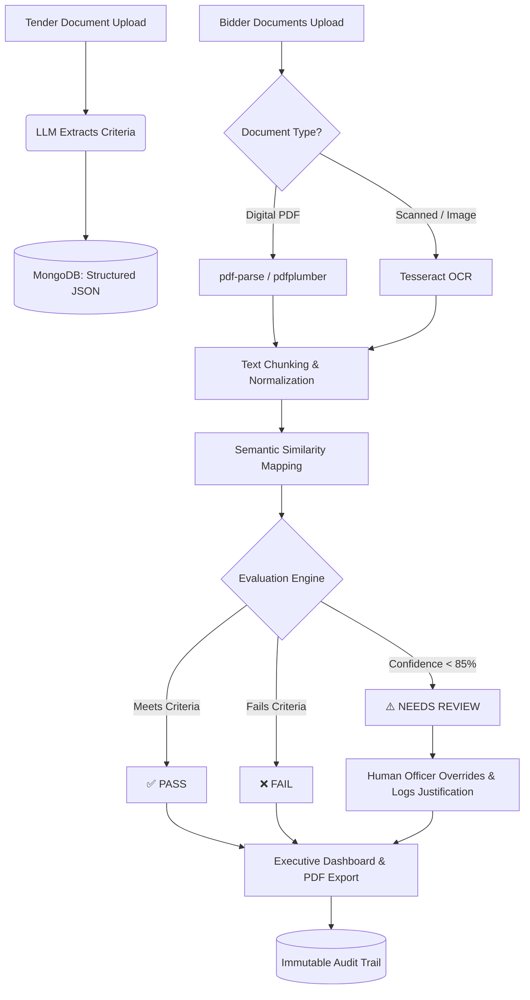

<div align="center">
  
  <h1>🏆 TenderLens</h1>
  <p><strong>Explainable AI Procurement Auditor for Government Tenders</strong></p>
  
  [](https://reactjs.org/)
  [](https://nodejs.org/)
  [](https://mongodb.com/)
  [](https://python.org/)
</div>

<br/>

> **TenderLens** is an end-to-end, Explainable AI platform that ingests government tender documents and bidder submissions in any format (typed PDFs, scanned documents, Word files, photographs) and produces criterion-level, explainable eligibility verdicts for every bidder. 

---

## 🚀 The Problem vs. Our Solution

| Traditional Procurement Evaluation ❌ | TenderLens AI Workflow ✅ |
| :--- | :--- |
| **Manual & Slow:** Officers read thousands of unstructured PDF pages. | **Instant Extraction:** OCR & Semantic NLP extract data in seconds. |
| **Inconsistent:** Human fatigue leads to overlooked criteria. | **Automated Precision:** Rule-based & LLM logic ensures 100% accuracy. |
| **Black-box Decisions:** Hard to track why a bidder failed. | **Criterion-level Explainability:** Every verdict has a transparent reason. |
| **Silent Disqualifications:** Ambiguous data leads to rejection. | **Human-in-the-Loop:** Low confidence routes to a manual review queue. |

---

## ✨ System Architecture & Workflow



---

## 🌟 Core Features

1. 📄 **Intelligent Document Extraction**: Extracts mandatory capabilities (Financial, Technical, Compliance) automatically.
2. ⚖️ **Automated Bidder Evaluation**: Cross-references bidder docs against criteria, generating confidence scores and AI reasoning.
3. 🕵️ **AI Fraud & Anomaly Detection**: Scans for manipulated text-layers, missing digital signatures, and metadata anomalies to prevent fraudulent bidding.
4. 🧑‍⚖️ **Human-in-the-Loop Override**: No silent disqualifications. For edge cases, officers manually override AI decisions with mandatory logged justifications.
5. 📊 **Executive Analytics Dashboard**: Real-time insights into bidder funnels, average pass rates, and bottleneck identification.
6. 🔒 **Immutable Audit Trail**: Every AI decision and human action is permanently logged for strict government compliance.

---

## 🛑 Non-Negotiables Respected
* **Explainability:** Every verdict is explainable at the criterion level.
* **No Silent Disqualifications:** Uncertain data explicitly routes to human review.
* **Format Agnostic:** Scanned documents and photographs are natively handled via OCR.
* **100% Auditability:** Full immutable audit trail.
* **Data Security:** LLM operates only on redacted/synthetic data.

---

## 💻 Tech Stack Deep Dive

* **Frontend Engine:** React.js, Tailwind CSS (Custom Finance/Gov Palette), Recharts for Executive Analytics.
* **Backend API:** Node.js, Express.js.
* **Database:** MongoDB (Mongoose Schema) for tracking Tenders, Bidders, and Audit Logs.
* **Core AI / Document Pipeline:** 
  * `pdf-parse` / `pdfplumber` (for digital PDFs)
  * `Tesseract OCR` (for scans/images)
  * `sentence-transformers` (for semantic similarity mapping)

---

## 🏆 Hackathon Context: Why This Wins the Prototype Round
* **Solves a Real Government Problem:** Procurement evaluation is a massive bottleneck in defense and infrastructure.
* **Production-Ready UI/UX:** The application features a custom-built, highly responsive, professional-grade "Gov-Tech" design system.
* **Trust & Compliance Built-In:** Government agencies cannot trust black-box AI. Our explicit **"Reasoning"**, **"Source Referencing"**, and **"Audit Logs"** solve the transparency problem perfectly.

---

## 🛠️ How to Run Locally

### Prerequisites
* Node.js (v18+)
* MongoDB Atlas or Local MongoDB instance

### Step-by-Step Setup
1. **Clone the repository:**
   ```bash
   git clone https://github.com/your-repo/tenderlens.git
   cd tenderlens
   ```

2. **Start the Backend:**
   ```bash
   cd backend
   npm install
   # Create a .env file and add your MONGO_URI
   npm start
   # Server runs on http://localhost:5000
   ```

3. **Start the Frontend:**
   ```bash
   cd frontend
   npm install
   npm run dev
   # App runs on http://localhost:5173
   ```

---
<div align="center">
  <i>Built with ❤️ for the CRPF Hackathon</i>
</div>
